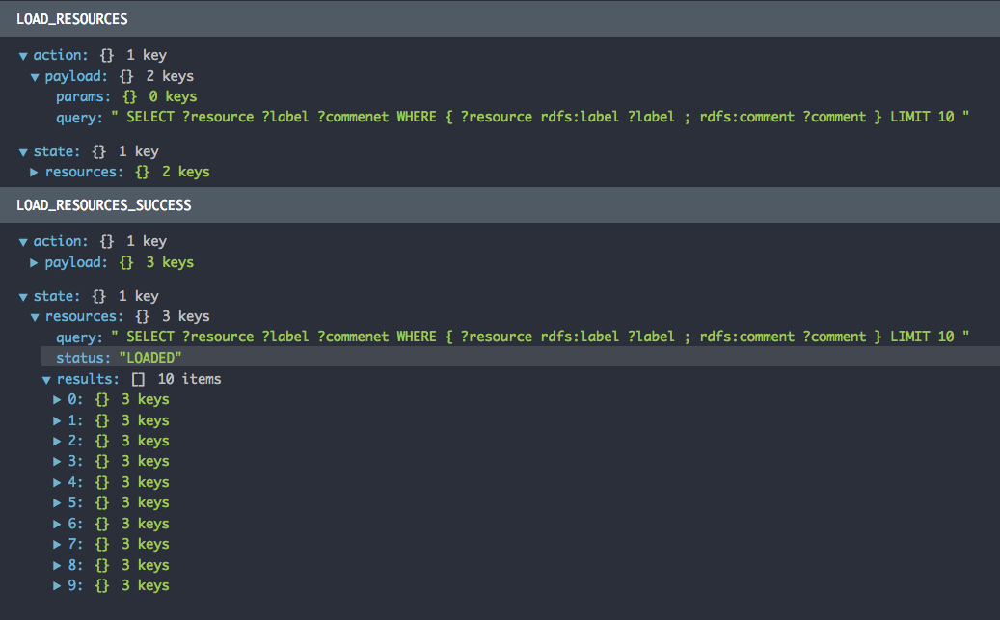
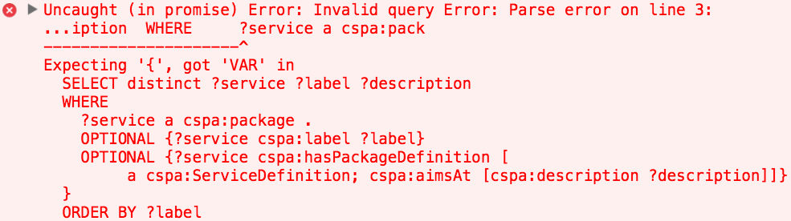

# Documentation


## Bootstrapping the application

This library relies on `redux` to manage the application state. So a `redux` store should be available to your react components. An easy way to do this is to use `react-redux` [`Provider`](https://github.com/reactjs/redux/blob/master/docs/basics/UsageWithReact.md#passing-the-store).

You first need to create a `redux` reducer which will track the fetch process and the results, and plug it into your `redux` store. Something like this:

```javascript
import { createStore } from 'redux'
import { Provider } from 'react-redux'

import { getReducer } from 'sparql-connect'

//`getReducer` creates the reducer used by sparql-connect
const store =  createStore(getReducer())

export default class Root extends Component {
  render() {
    return (
      <Provider store={store}>
        (...)
      </Provider>
    )
  }
}

```


## A simple example

The shortest way to populate a component with some query results is as follows:

```javascript
import { sparqlConnect, setQueryURL } from 'sparql-connect'

//Set the sparql endpoint (should be done once for the whole application)
setQueryURL('http://example.com/sparql')

//Write a query that returns some resources with the additional field `label`
const query = `
  SELECT ?resource ?label
  WHERE { ... } 
`
//Create a connector to populate the component with the results
const connector = sparqlConnect(query)

//Write a component assuming the query results will be available as a prop
//named `results`
function ResourcesList({ results }) {
  return (
    <ul>
      {
        results.map(({ resource, label }) => 
          <li key={resource}>{ label }</li>
        )
      }
    </ul>
  )
}

//Connect the query to your component
export default connector(ResourcesList)
```

First we import the `sparqlConnect` function to connect the component to the query, and we set the `sparql` endpoint. Then we define a `sparql` query as a single string, and we build a `connector` based on this query. This connector will be used to bind the component to the query. It enables us to write a component, assuming everything went well with the query, the network and the server, and that the results are available as a prop named `results`. This prop is an array of objects, with each item representing a line in the result set and, as so, made of as many properties as fields in the query. In this example each item has two properties: `resource` and `label`.

The `connector` returned by `sparqlConnect(query)` is a function which takes a component as its first argument (the component we want to connect to the query), and some options as a second argument (see [errors](#waiting-for-the-results-and-handling-errors))

Then, we can use this component as follows:

```javascript
import ResourcesList from '...'

function MyComponent() {
  return (
    <div>
      <h1>Below a list of resources</h1>
      <ResourcesList />
    </div>
  )
}
```

## A more complex example

Sometimes, we will need to give some parameters to the query. Let's say for instance that we want to keep only the items matching some criteria, or that we want some details about a given resource.

In these situations, our "generic" query cannot be represented as a string anymore. We will represent it as a function, a query builder, which will take some arguments that will need to be valued in order to build the query.

```javascript
//we return some information about a given resource
const queryBuilder = resource => `
  SELECT ?label ?comment
  WHERE {
    ${resource} rdfs:label ?label ;
                rdfs:comment ?comment
  }
`

//We need to give an extra argument to `sparqlConnect` with some configuration
const connector = sparqlConnect(queryBuilder, {
  params: ['resource']
})

function DetailsComponent(...) { ... }

export default connector(DetailsComponent)
```

Since we use a query builder function and not a string to represent the query, we need to give some extra information to `sparqlConnect`. The second argument of `sparqlConnect` is a configuration object which holds this extra information. Before seeing what the `params` option means, let's see how we will call our component.

In a real world example, we will likely have a parent component that will  pass information about which resource details to show. Something like:


```javascript
function ParentComponent() {
  //we keep it simple with the selection of the resource hard coded
  const selectedResource = '...'
  return (
    <div>
      <h1>Details about a selected resource</h1>
      <DetailsComponent resource={selectedResource} />
    </div>
  )
}
```

How do we know that the selected resource should be passed as a prop named `resource`, and not `selectedReource` for instance ? That's what the `params` option in the connector configuration is used for. Then, since `params` is an array of one element, the connector will pass the value of the prop named `resource` as the first and only argument of the query builder. If the query builder needed more than one argument, we should add some entries to `params` and make sure that the parent component will pass one prop named after each item in params.

To sum-up:
- each item in `params` should match the name of a prop that the parent component will pass to the connected component ;
- the value of these props will be passed as arguments to the query builder function, in the order they appear in params.

In our example, the name we gave to the first argument of our query builder function matches the first entry in params. It's simply because `resource` is a good name to designate a resource, but it does not need to be this way. The query builder could be rewritten with no consequence like this:

```javascript
const queryBuilder = meaninglessName => `(...) ${meaninglessName} (...)`
```

## More options

### Expecting only one line in the result set (`singleResult`)

The query in the last example retrieves some details for one resource. That kind of query usually expects only one row in the result set, each field representing one detail of this resource. Hence, in practice, dealing with the results look like this:
- if the query returns zero or more than one row, show an error ;
- extract all the properties the first and only row is made of.

The `singleResult` option is intended to make queries like this more easy to process. If `singleResult` is set to `true`, special rules apply when processing the results. We expect one and only one row in the results, so it will throw an error if there is no result or more than one row. Plus, results won't be exposed to the component as an array, but the fields will be passed directly to the component as props. Our previous example becomes:

```javascript
//we return some information about a given resource
const queryBuilder = resource => `
  SELECT ?label ?comment
  WHERE {
    ${resource} rdfs:label ?label ;
                rdfs:comment ?comment
  }
`

//We need to give an extra argument to `sparqlConnect` with some configuration
const connector = sparqlConnect(queryBuilder, {
  params: ['resource'],
  singleResult: true
})

//Our component will not receive a prop named `results`, but a prop named after
//each field in the query, containing the value corresponding to the one and
//only item.
function DetailsComponent({ label, comment }) {
  return (
    <div>
      <span>Resource label is: { label }</span>
      <span>Resource comment is: { comment }</span>
    </div>
  )
  
}

export default connector(DetailsComponent)
```

### Give the query a name (`queryName`)

We can add the `queryName` option to the configuration object. This has two consequences.

First, the results will be exposed to the connected component as a prop named after the query, instead of the generic name `results`. That means that we can rewrite the first example like this:

```javascript
const connector = sparqlConnect(query, {
  queryName: 'services'
})

// The connected component will access the results through a prop named after
// `queryName`, instead of `results`
function ResourcesList({ services }) {
  return (...)
}
```

Remark: the query name has no effect on the prop names if `singleResult` is set to `true`, since in this case, there is one prop for each field in the query.

Second, it makes debugging easier. `sparqlConnect` uses `redux` to manage the application state (the status of each query request and the results of past queries). If the query was given a name, it will be valued to give meaningful names to redux actions and to the objects where results are stored in the application state. To illustrate this, we can have a look at the `redux` dev tools with the previous example:



Consider defining a query name as a **best practice**.

### Give the results a name (`whatWeGet`)

If the query name or `results` (in case no query name was defined) is not a good candidate for the name of the prop containing the results, you can override it with `whatWeGet`. It is a convenient option if you want to use the same component with multiple queries. For instance 

```javascript
const someResourcesQuery = "SELECT (...)"
const otherResourcesQuery = "SELECT (...)"

const someConnector = sparqlConnect(someResourcesQuery, {
  queryName: 'someResourcesQuery',
  whatWeGet: 'services'
})

const otherConnector = sparqlConnect(otherResourcesQuery, {
  queryName: 'otherResourcesQuery',
  whatWeGet: 'services'
})

function GenericResourceList({ services }) {
  (...)
}

const someConnectedComponent = someConnector(GenericResourceList)
const otherConnectedComponent = otherConnector(GenericResourceList)
```

Remark: we put all the code in one place for the sake of readability, but in practice, it would be a better option to create one file with the generic component definition, and two other files with the connected components.

### Waiting for the results and handling errors

A connected component will show a default message while the request is pending, and some possible error message if something went wrong with the query, the server or the network. These messages are customizable with the `loading` and `error` options passed as a second argument to the connector function (the first argument is the component). These options expects a component which will be renderer if appropriate. For instance with the first example:

```javascript

export default connector(ResourcesList, {
  loading: () => <span>Resources are loading</span>,
  error: () => <span>Something went wrong</span>
})
```

These components will receive the props passed by the parent of the connected component: this allows further customization. The `error` component will also receive a prop named `error` with some information about what occurred.

### Use mutlitple queries in a component

In order to value the results of multiple queries in the same component, we can use the `sparqlCombine` function (see [service.js](../src/js/components/services/service.js)):

```javascript
const connector = sparqlCombine(
  sparqlConnect(serviceDetails, {
    queryName: 'serviceDetails',
    params: ['service'],
    singleResult: true
  }),
  sparqlConnect(serviceInputs, {
    queryName: 'serviceInputs',
    params: ['service']
  }),
  sparqlConnect(serviceOutputs, {
    queryName: 'serviceOutputs',
    params: ['service']
  }),
  sparqlConnect(serviceSubs, {
    queryName: 'serviceSubs',
    params: ['service']
  })
)
```

You can use this option for instance if you need to compose small components which for some reasons cannot be connected to create a more complex component. In this case, the connection could be handled by the parent component which would pass the results to the child components.

## Checking query syntax

Before sending a query to the server, `sparql-connect` will check the query syntax. If it's not correct, an error will be thrown, visible in the console.



## Missing prefixes

It will also check if all the prefixes used in the query body are defined. If you want some prefixes to be added automatically when needed, you can set them with `setPrefixes`. It should be done once for the whole application (not on a per query basis).

```javascript
import { setPrefixes } from 'sparql-connect'

//An object with prefixes that can be added automatically if needed
setPrefixes({
  aPrefix: 'http://...'
})

//You can then write
const query = `
SELECT ?s ?o { ?s aPrefix:aPredicate ?o }
`
```

By default, `rdf` and `rdfs` prefixes are defined. If you don't want to use this option, you can simply pass an empty object to `setPrefixes`.

## Under the hood

`sparqlConnect` uses `redux` to manage the state of the query requests and the query results. It will create three actions for each query `LOAD_XYZ`, `LOAD_XYZ_SUCCESS`, `LOAD_XYZ_FAILURE` (where `XYZ` is the query name if defined, or an automatically incremented string if not). It will also create a reducer function which is able to handle all these actions, and store the corresponding payload (query, results and possible error message) (see redux dev tools screenshot above).